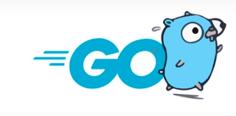

  Go勉強会ガイダンス

  インフラ開発部 SRE課（今本/上村)

# Go言語の特徴

- Go言語はGoogleが開発したプログラミング言語
- 文法がシンプル、高速、並行処理が得意などの特徴を持つ

# なぜインフラ開発部でGo言語を学ぶのか

- Webアプリ等だけでなく、インフラ系ツールの実装にも多く使われている
  - Kubernetes, Docker, Terraform等
- 特にKubernetesでは自作のカスタムコントローラーをGoで記述するため、Goに触れる機会が多い
- そのため、インフラエンジニアもGo言語を習得する必要性が高い

# 本勉強会が想定する参加者、勉強会のゴール

- アプリケーション開発に詳しくない人が参加することを想定した内容です。
  - ただし「変数」「関数」等、ごく初歩的なプログラミング用語はある程度知っている前提です（mustではない）
- 勉強会の開催期間は半年で、前後半に分けてテーマを変更します。
- 前半：基礎編
  - 演習問題を各自で解きながらGoの基本的な文法を習得します。
  - 詳しい進め方については次のスライドから説明します。
- 後半：実践編
  - 週替わりで実装担当者を決めて、GoのCLIツールを1つ完成させることで実装力を高めます。
  - 完成させるツールの詳細については検討中のため、このガイダンス内での説明はありません。

# 基礎編の進め方について

# 基礎編の各回の進め方

- 前半（約30分）
  - [A Tour of Go](https://go-tour-jp.appspot.com/)の読み合わせ
  - その週の履修範囲となっているトピックの説明をファシリテーターが実施
  - 各トピックに付属されているプログラムは手元で各自実行してもらう
    - サイト上での実行が可能
  - トピックごとに分からないところが無いかを確認し、都度質問してもらう

# 基礎編の各回の進め方

- 後半（約30分）
  - リポジトリに準備された演習問題を各自で実装する
    - 各自でブランチを切って作業する
    - 未実装になっているメソッドを実装する形をとる
  - 実装が終わったらGitHubにPushして、CIが通ればクリア

# その他ルール

- 各自で切るブランチ名は`講座開始月/自身の名前`としてください。
  - 識別できれば良いので、名前部分はGitHubのアカウント名とかでも大丈夫です
- 演習問題を早めにクリアした人は、他の人のヘルプをぜひよろしくお願いします。
- 解答を載せたブランチ（`feature/subject-examples`）がありますが、事前の閲覧は控えてください。
  - 演習問題を自力で解いてもらいたいため
- 演習問題を解く時間も含めた時間配分となっているので、演習問題は事前に解かずに当日を迎えてください。

# 環境構築

# 開発スタイル

- 開発スタイルによって環境構築作業が異なります。
  - ローカルの実行環境にGoをインストールして開発する場合
  - VSCodeのDevContainers拡張機能を使ってDockerコンテナ上で開発する場合

# DevContainersとは

- Dockerコンテナを起動させて、コンテナ上にあるソースコードを直接編集するVSCodeの機能
- Dockerコンテナ起動時にローカル環境のソースコードをマウントさせることで、ローカル環境のファイルとの同期も取られる

# DevContainersの利点

- 開発環境をDockerfileやdocker-compose.ymlに明記できるので、開発に必要なツールがインストールされた状態で開発を始められる
  - 例えば今回の場合、Goの実行環境やタスクランナー(go-task)、開発用ツールなどが事前にインストール済み
- devcontainer.jsonの値を書き換えれば、vscodeの設定や拡張機能も共通化できるようになる
  - 開発環境を統一できる
- 開発環境がコンテナ内で完結するので、ローカル環境を汚さずに開発ができる

# 事前準備について

- dockerコマンドを実行する環境を準備済みの前提です

# ローカルの実行環境にGoをインストールした開発する場合

## 必要な作業

1. ローカル環境へのGoのインストール [手順](https://go.dev/doc/install)
  a. Linux(ログインシェルbash)の例
  `rm -rf /usr/local/go && tar -C /usr/local -xzf go1.19.2.linux-amd64.tar.gz`
  `vi ~/.bashrc`で"export PATH=$PATH:/usr/local/go/bin"を追記
  `source ~/.bashrc`
  `go version`
2. ローカル環境へのタスクランナー(go-task)インストール [手順](https://taskfile.dev/installation/#go-modules)
`go install github.com/go-task/task/v3/cmd/task@latest`

# ローカルの実行環境にGoをインストールした開発する場合

## 必要な作業

3. [リポジトリ](https://github.com/kurupeku/hello-golang)をclone
最終ページに注意事項あり
4. cloneしたプロジェクトのルートディレクトリでローカル環境でテストを実行してみる
  a. ローカルで実行する場合
  `task test -- subject/chapter00`
  b. Docker上で実行する場合
  `task docker-build` (初回のみ)
  `task docker-test -- subject/chapter00`

# VSCodeのDevContainers拡張機能を使ってDockerコンテナ上で開発する場合

## 必要な作業

1. [リポジトリ](https://github.com/kurupeku/hello-golang)をclone
最終ページに注意事項あり
1. VSCodeをインストールし、cloneしたリポジトリを開く
1. Remote Development拡張をVSCodeにインストール
1. VSCodeの左下の `><` アイコンをクリックし `Reopen in Container` を選択
1. コンテナ上でソースコードが閲覧・編集できることを確認
1. VSCodeのターミナル上からテストを実行してみる
`task test -- subject/chapter00`

※DevContainerにGoの実行環境が内包されているので、Goのインストールは不要

# 実演

1. リモートリポジトリをclone
次ページに注意事項あり
1. 自分用のブランチを作成
1. VSCode上でDevContainerを開く
1. サンプル問題を実装する
1. ローカル環境でテストがパスすることを確認
1. リモートリポジトリにpush
1. GitHub上でCIが通っていることを確認

# リモートリポジトリのcloneに関する注意点

他のGitアカウントをPC上で使っている場合、Gitユーザーのglobal設定が既に存在しているので、
以下の手順でcloneして勉強会用リポジトリの設定を追加してください。

1. Personal Access Tokenを`Settings`>`Developer Settings`>`Personal access tokens`>`Generate new token`で生成
1. `git clone https://[アカウント名]:[Personal Access Token]@github.com/kurupeku/hello-golang`でclone
1. `cd hello-golang`
1. `git config --local user.name [アカウント名]`
1. `git config --local user.email [メールアドレス]`
`Settings`>`Emails`で`Keep my email addresses private`を有効化し、記載されたメアドを入力

